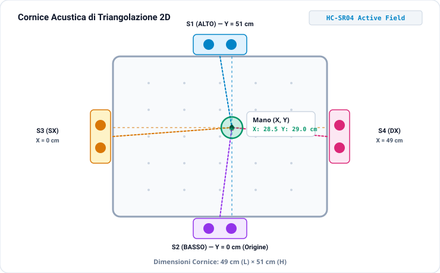
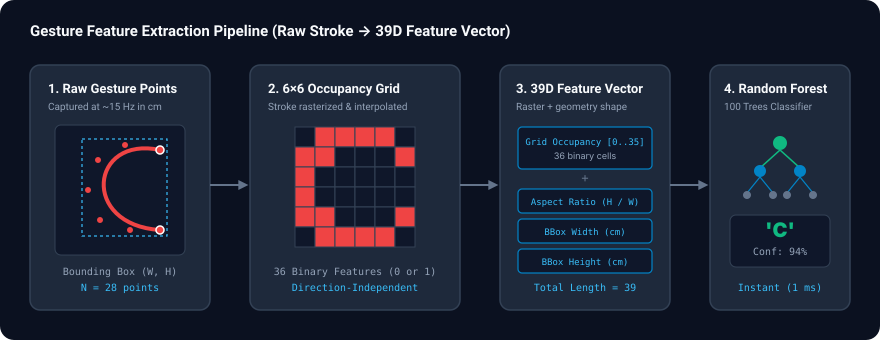

# Ultrasonic Hand Gesture Tracker & Classifier

<p align="center">
  
  
  
  
  
</p>

Track hand gestures in mid-air and classify letters (`C, D, G, I, J, L, M, N, O, P, S, U, V, W, Z`) using 4 cheap ultrasonic sensors, an Arduino Nano, Python, and a Random Forest classifier.

No cameras, no wearables, no computer vision libraries—just high-frequency acoustic waves bouncing off your hand.

---

## Table of Contents
- [How It Works](#how-it-works)
- [Data Processing Pipeline](#data-processing-pipeline)
- [Hardware Setup](#hardware-setup)
- [Project Structure](#project-structure)
- [Quick Start](#quick-start)
  - [1. Flash the Arduino](#1-flash-the-arduino)
  - [2. Install Dependencies & Start Server](#2-install-dependencies--start-server)
  - [3. Record, Train & Test](#3-record-train--test)
- [Troubleshooting](#troubleshooting)
- [License](#license)

---

## How It Works

1. **The Sensor Arena**: 4 ultrasonic sensors (HC-SR04) are arranged along the perimeter of a 49 × 51 cm rectangle (Top, Bottom, Left, Right).
2. **Pythagorean Triangulation**: As your hand moves inside the frame, opposing pairs of sensors measure distances. Using the difference-of-squares formula, hand depth cancels out completely, yielding precise 2D (X, Y) plane coordinates in centimeters.
3. **Live Web App**: An interactive web UI displays your hand's position in real time with tracking crosshairs and 1D axis sliders.
4. **Gesture Recording**: Click a letter button (`C`, `L`, `O`, etc.), draw the stroke in mid-air, and click the button again to save the trajectory to CSV. A live red trail visually renders your stroke in real time.
5. **AI Classification**: Converts accumulated gestures into a direction-independent 6×6 spatial occupancy grid and predicts the drawn letter using a Random Forest model.

<p align="center">
  
</p>

---

## Data Processing Pipeline

Raw gesture data is a time-series stream of (X, Y) coordinates. To make classification robust, ultra-fast (<1 ms inference), and **stroke-direction independent** (drawing an `O` clockwise or counterclockwise yields the same representation), each gesture undergoes a 3-step feature extraction pipeline:

<p align="center">
  
</p>

### 1. Bounding Box Normalization
* Finds the gesture's spatial envelope: `min_x`, `max_x`, `min_y`, `max_y`.
* Normalizes coordinates into a localized grid space [0, 5]:

```text
norm_x = ((x - min_x) / width) * 5
norm_y = ((y - min_y) / height) * 5
```

* **Result**: Complete **position-invariance**—a letter drawn in the corner produces the exact same features as one drawn in the center.

### 2. 6×6 Spatial Occupancy Grid (36 features)
* A 6 × 6 binary matrix tracks which spatial cells were activated by the hand.
* **Trajectory Interpolation**: When the hand moves quickly between sensor sampling frames, linear interpolation connects consecutive points so fast strokes do not leave gaps.
* **Result**: Stroke-order and direction independence.

### 3. Global Shape Metrics (3 features)
* **Aspect Ratio**: `height / width` (distinguishes tall letters like `I` from wide letters like `M` or `W`).
* **Physical Bounding Box**: Width (cm) and height (cm).

> **Feature Vector**: 36 (grid cells) + 3 (shape metrics) = **39 features**.  
> Both offline model training (`train_classifier.py`) and live WebSocket inference (`server.py`) share this exact pipeline via `features.py`.

---

## Hardware Setup

### Components
- **Microcontroller**: Arduino Nano (ATmega328P)
- **Sensors**: 4× HC-SR04 ultrasonic distance sensors
- **Breadboard & Jumper Wires**

### Wiring Pinout

| Sensor | Position | Distance Axis | TRIG Pin | ECHO Pin |
| :--- | :--- | :--- | :---: | :---: |
| **S1** | Top | Y (51 cm) | `D9` | `D10` |
| **S2** | Bottom | Y (0 cm, Origin) | `D7` | `D8` |
| **S3** | Left | X (0 cm, Origin) | `D3` | `D4` |
| **S4** | Right | X (49 cm) | `D5` | `D6` |

* **Baud Rate**: `115200`
* Power: Connect all sensor VCC pins to 5V and GND to Arduino GND.

---

## Project Structure

```text
.
├── src/
│   └── main.cpp              # Arduino firmware (multi-sensor polling & serial stream)
├── server.py                 # FastAPI backend, WebSocket broadcaster & live inference
├── index.html                # Responsive web app (live tracking, trail visualizer, ML controls)
├── features.py               # Feature extraction (6x6 occupancy rasterization & normalization)
├── train_classifier.py       # Random Forest training script & cross-validation
├── models/
│   └── gesture_rf.joblib     # Serialized trained scikit-learn model
├── recordings/
│   ├── gestures.csv          # Recorded gesture dataset (raw point trajectories)
│   └── training_matrix.csv   # Processed 39D training matrix (X features + y labels)
├── docs/assets/              # SVG architecture and pipeline diagrams
├── platformio.ini            # PlatformIO board & build configuration
└── pyproject.toml            # Python project dependencies
```

---

## Quick Start

### 1. Flash the Arduino
Make sure PlatformIO is installed, then build and flash the Nano:
```bash
pio run --target upload
```

### 2. Install Dependencies & Start Server
Using `uv` (recommended):
```bash
uv run server.py
```
Or with standard Python virtual environment:
```bash
python3 -m venv .venv
source .venv/bin/activate
pip install -r pyproject.toml
python server.py
```
Open your browser at **`http://localhost:8000`**.

### 3. Record, Train & Test
1. **Record**: Click any letter button (`C`, `L`, `O`, etc.). Move your hand into the frame to start the stroke. When finished, click the letter button again to save the sample to `recordings/gestures.csv`.
2. **Retrain**: Click **Retrain Model** directly in the web UI (or run `python train_classifier.py`). The model will train and reload live with zero server downtime.
3. **Test Gesture**: Click **Test Gesture**, draw a stroke in mid-air, and click **Classify Gesture** to see top predictions and confidence levels.

---

## Troubleshooting

<details>
<summary><b>Serial port not auto-detected</b></summary>

The backend automatically searches for active serial devices (`/dev/ttyUSB*`, `/dev/ttyACM*`, or Windows `COM*`). If disconnected, check your USB connection or ensure your user has permissions to access the serial port:
```bash
sudo usermod -a -G dialout $USER
```
</details>

<details>
<summary><b>Jittery hand coordinates</b></summary>

Ultrasonic sensors can receive multipath reflections if objects are placed near the edge of the frame. Keep the inner arena clear of obstacles and maintain your hand at a flat angle to bounce echoes back to opposing sensors.
</details>

---

## License
This project is open-source under the [MIT License](LICENSE).
