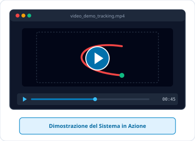
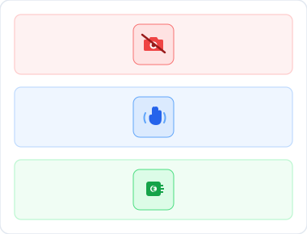
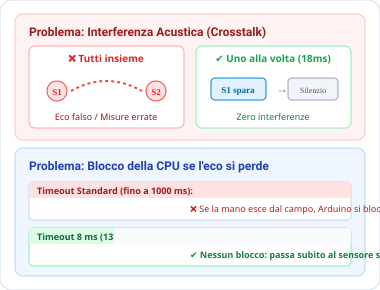
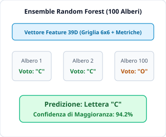
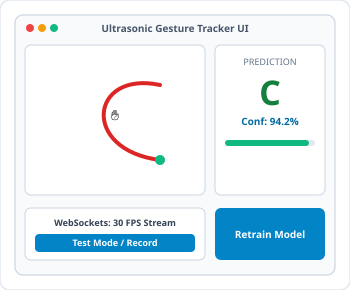
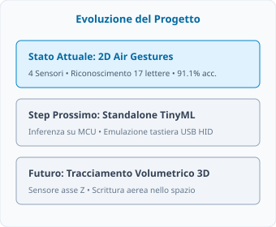
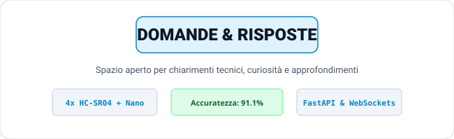

<!-- _class: hero -->
<!-- _paginate: false -->

# Riconoscimento lettere in 2D con sensori di distanza

  

Progetto di Gruppo — Interazione Uomo-Macchina / Sistemi Embedded

---

## Dimostrazione del Sistema

### Il Sistema in Azione
* **Tracciamento dal Vivo:** Disegno di lettere a mezz'aria all'interno della cornice acustica
* **Visualizzazione Real-Time:** Scia rossa fluida renderizzata sul Canvas a 30 FPS
* **Classificazione Istantanea:** Riconoscimento della lettera e stima di confidenza al termine del tratto
* **Zero Dispositivi Indossabili:** Libertà totale di movimento senza telecamere né guanti

---

## Obiettivi e Motivazioni

### Perché gli ultrasuoni?
* **Privacy-First:** Nessuna telecamera né acquisizione ottica negli ambienti
* **Zero Dispositivi Indossabili:** Nessun guanto o anello smart
* **Economicità Estrema:** Pochi euro di componenti hardware contro costosi sistemi ottici

<b>Traguardo:</b> Riconoscere 17 lettere disegnate a mezz'aria in una cornice 49×51 cm con accuratezza &gt;90%.

---

## Formulazione del Problema: Classificazione Multiclasse

### Natura del Task: Riconoscimento di Pattern
* Il sistema risolve un problema di **classificazione multiclasse supervisionata**: mappare una sequenza gestuale continua in una categoria simbolica discreta.

### Input e Output del Modello
* **Input Grezzo:** Serie temporale di coordinate $(X, Y)$ rilevate durante il movimento della mano
* **Input al Modello:** Vettore di feature numeriche a 39 dimensioni estratto al termine del gesto
* **Output:** Etichetta discreta della classe (tra 17 lettere dell'alfabeto) con la relativa distribuzione di confidenza

---

## Hardware & Geometria di Triangolazione

### La Cornice Acustica ($49 \times 51\text{ cm}$)
* **4 Sensori HC-SR04** posti sui punti mediani dei lati
* Asse verticale: S1 (Alto) e S2 (Basso)
* Asse orizzontale: S3 (Sinistra) e S4 (Destra)

### Il Trucco della Triangolazione
* La mano si muove a mezz'aria, quindi ha anche un'altezza (quota).
* Confrontando i due sensori opposti (es. Sinistra e Destra), **l'altezza della mano si annulla nei calcoli**.
* Otteniamo la posizione esatta 2D $(X, Y)$ anche se alziamo o abbassiamo la mano mentre disegniamo!

---

## Firmware Arduino: Sfide Acustiche e Temporali

### 1. Interferenza Acustica (Crosstalk)
* **Il problema:** Se i 4 sensori sparano insieme, l'eco di uno viene captato per sbaglio da un altro (misure false).
* **La soluzione:** **Interrogazione sequenziale** (S1 $\to$ S2 $\to$ S3 $\to$ S4) con pausa di **18 ms** tra i pings per far decadere i rimbalzi.

### 2. Gestione dei Timeout
* **Il problema:** Di default, se un'onda non torna indietro Arduino si blocca in attesa fino a 1 secondo!
* **La soluzione:** **Timeout ridotto a 8 ms** (~137 cm max). Se l'eco non torna, scarta il dato e continua subito senza bloccare lo streaming (~18-20 Hz).

---

## Raccolta Dati & Pulizia del Segnale

### Filtri sul Flusso Seriale
* **Filtro Mediana Mobile:** Finestra a 5 campioni per attenuare il jitter continuo
* **Reiezione Salti:** Scarta variazioni brusche anomale nel singolo frame
* **Recupero Dinamico:** Riconosce i cambi di traiettoria intenzionali e rapidi

### Raccolta del Dataset
* Acquisizione interattiva tramite interfaccia web
* **191 registrazioni complessive** su 17 lettere
* Campioni acquisiti da diversi utenti a varie velocità

---

## Feature Engineering: Invarianza Spaziale e Morfologica

### I 3 Passaggi Chiave:
1. **Normalizzazione & Centratura:**
   * Scalatura uniforme basata sul lato maggiore
   * La lettera mantiene le sue proporzioni originali
2. **Griglia di Occupanza $6 \times 6$ (36 celle):**
   * Matrice binaria delle celle attraversate
   * **Interpolazione lineare** tra punti: nessun buco
   * Completa invarianza da senso orario o antiorario!
3. **Metriche Globali (3 valori):**
   * Rapporto di forma, larghezza e altezza in centimetri

---

## Modello di Machine Learning in Python

### Scelta del Modello: Random Forest
* **Dataset Compatto:** Evita il rischio di memorizzazione tipico delle reti neurali profonde
* **Robustezza alle Feature Miste:** Gestisce assieme flag binari di griglia e metriche geometriche
* **Inferenza Istantanea:** Previsione in meno di un millisecondo
* **Aggiornamento a Caldo:** Riaddestramento live senza interruzione del server

### Protocollo di Validazione
* **Stratified 5-Fold Cross-Validation:** Tutte le classi bilanciate tra training e test

---

## Risultati Sperimentali & Analisi degli Errori

### Metriche Globali
* **Accuratezza Totale:** **91.1%**
* **Precision Macro:** **91.3%**
* **Recall Macro:** **90.9%**

### Lettere con Prestazioni Massime
* **P, G (100%):** Tratti chiusi inconfondibili
* **I, S, A (>95%):** Spiccata unicità morfologica

### Ambiguità Rilevate
* **D vs J:** Parte superiore aperta nei tratti veloci
* **M vs N:** Risoluzione griglia sul picco centrale

---

## Architettura Software & Interfaccia Utente

### Web App Reattiva Full-Stack
* **Radar 2D Interattivo:** Traccia la posizione della mano in tempo reale con visualizzazione dei raggi
* **Scia Rossa Dinamica:** Rendering fluido del tratto disegnato a mezz'aria
* **Classificazione Live:** Mostra le 4 predizioni più probabili con percentuali di confidenza
* **Retrain con Un Click:** Aggiorna il modello direttamente dal browser

---

## Conclusioni & Sviluppi Futuri

### Risultati Ottenuti
* Interazione touchless affidabile senza dispositivi ottici
* Invarianza geometrica grazie alla griglia di occupanza con interpolazione
* Sistema integrato reattivo a bassissima latenza

### Limiti Fisici
* Frequenza vincolata dalla velocità del suono in aria
* Sensibilità all'inclinazione del palmo

### Direzioni Future
* Air-writing volumetrico 3D
* Porting su microcontrollore (Edge / TinyML)

---

<!-- _class: hero -->
<!-- _paginate: false -->

# Grazie per l'Attenzione!
### 2D Ultrasonic Hand Tracker & Classifier

  

Siamo a disposizione per qualsiasi domanda o approfondimento tecnico!