<!-- _class: hero -->
<!-- _paginate: false -->

# Riconoscimento lettere in 2D con sensori di distanza

  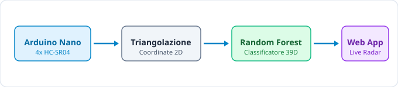

<a class="github-link" href="https://github.com/imivi/distance-sensor-hand-tracker" target="_blank">github.com/imivi/distance-sensor-hand-tracker</a>

---

## Dimostrazione del Sistema

### Caratteristiche

* **Tracciamento in tempo reale:** disegno di lettere a mezz'aria nella cornice
* **Classificazione della lettera:** riconoscimento della lettera e classificazione con un click
* **Registrazione e allenamento in tempo reale:** i nuovi gesti vengono registrati e il modello viene riaddestrato in tempo reale
* **Nessun dispositivo indossabile:** senza telecamere né guanti

<video src="assets/video.mp4" controls loop width="560"></video>

---

## Interfaccia web

### Funzionalità dell'Applicazione

* **Visualizzazione gesto:** tracking continuo della mano con scia del movimento
* **Stima del gesto:** l'interfaccia riporta la lettera stimata con percentuale di affidabilità
* **Registrazione gesti con un click** e salvataggio automatico su CSV
* **Riallenamento modello con un click** sui dati raccolti

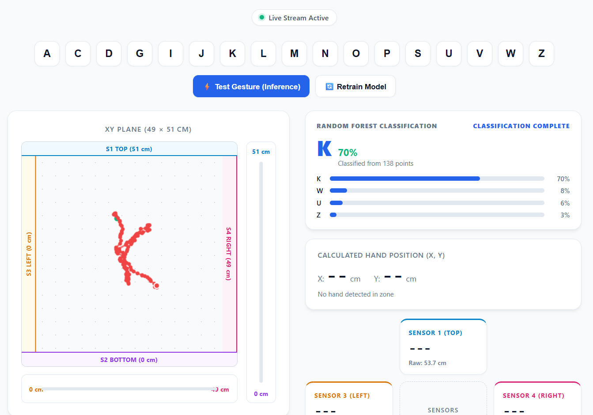

---

## Sensori e classificazione

### Riconoscimento dei gesti

* Il sistema risolve un problema di **classificazione supervisionata** (17 classi): mappare una sequenza continua di movimenti (coordinate) in una categoria discreta.

### Input e Output del Modello

* **Input dei sensori:** Serie temporale di coordinate $(X, Y)$ rilevate durante il movimento della mano
* **Input al modello di ML:** Vettore di feature numeriche a 39 dimensioni estratto al termine del gesto
* **Output:** etichetta discreta della classe (tra 17 lettere dell'alfabeto) con la relativa distribuzione di confidenza

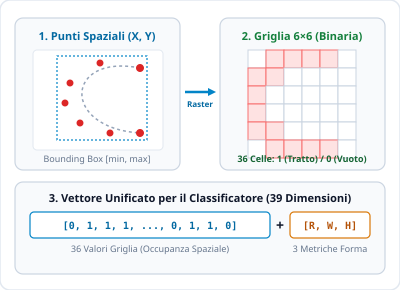

---

## Configurazioni hardware: 3 tipi testati

### Configurazioni testate

**1. Quattro Sensori in Parallelo:**
* Disposti sulla stessa linea: misuravano solo la profondità 1D con forti interferenze acustiche tra loro. Bassa risoluzione sull'asse X

**2. Due Sensori Perpendicolari (X, Y):**
* Disposizione ad "L": mappava il piano, ma l'altezza della mano ($Z$) falsava le coordinate $(X, Y)$.

**3. Quattro sensori opposti (2 per asse, scelta finale):**
* Cornice chiusa $49 \times 51\text{ cm}$: confrontando i sensori opposti, la profondità del gesto viene compensata

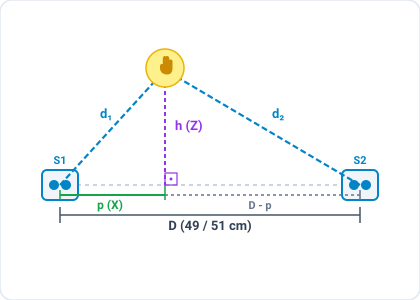

---

## Firmware Arduino: ottimizzazioni

### 1. Interferenza Acustica (Crosstalk)
* Se i 4 sensori vengono usati contemporaneamente, l'eco di uno viene captato per sbaglio da un altro.
* **La soluzione:** lettura in sequenza (S1 $\to$ S2 $\to$ S3 $\to$ S4) con pausa di **18 ms** tra i pings per far decadere i rimbalzi.

### 2. Gestione dei Timeout
* Di default, se un'onda non torna indietro Arduino si blocca in attesa fino a **1 secondo**
* **La soluzione:** timeout ridotto a 8 ms (~137 cm max). Se l'eco non torna, scarta il dato e continua subito senza bloccare lo streaming (~18-20 Hz).

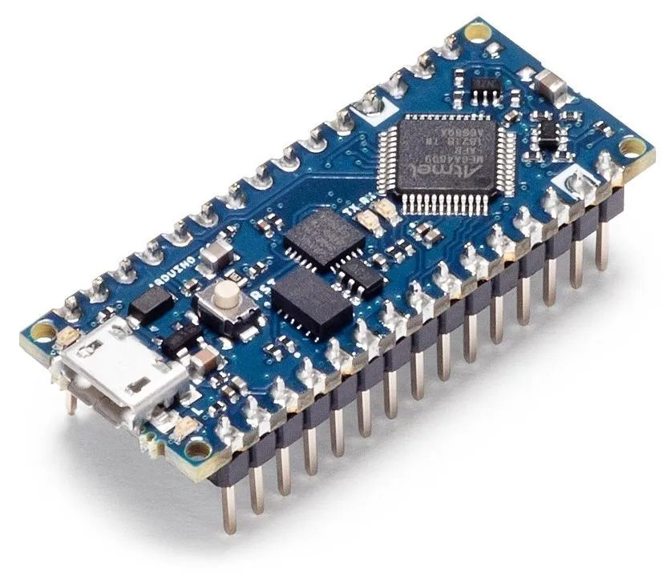
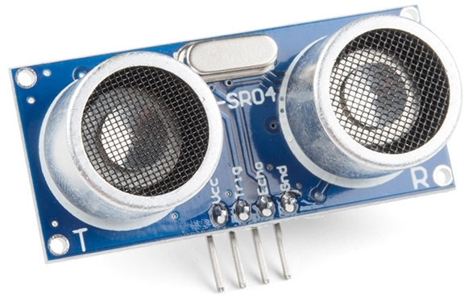

---

## Raccolta dati & pulizia del segnale

### Filtri sul flusso seriale
* **Filtro mediana mobile:** Legge gli ultimi 5 valori letti e prende la mediana per attenuare il jitter continuo
* **Scarto dei valori anomali:** Scarta variazioni brusche anomale nel singolo frame ("salti")
* **Recupero Dinamico:** Riconosce i cambi di traiettoria intenzionali e rapidi

### Creazione del dataset
* Acquisizione interattiva tramite interfaccia web
* **191 registrazioni complessive** su 17 lettere
* Campioni acquisiti da diversi utenti a varie velocità (quindi vari numeri di punti per lettera)

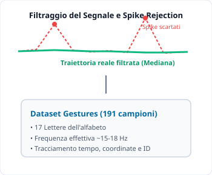

---

## Elaborazione dati

### Conversione da coordinate a griglia di punti
1. **Normalizzazione & Centratura:**
   * Scaling uniforme basato sul lato maggiore
   * La lettera mantiene le sue proporzioni originali
2. **Griglia di Occupanza $6 \times 6$ (36 celle)**
   * Matrice binaria delle celle attraversate
   * **Interpolazione lineare** tra punti: nessun buco
   * Completa invarianza da senso orario o antiorario
3. **Metriche Globali (3 valori)**
   * Rapporto di forma, larghezza e altezza in centimetri

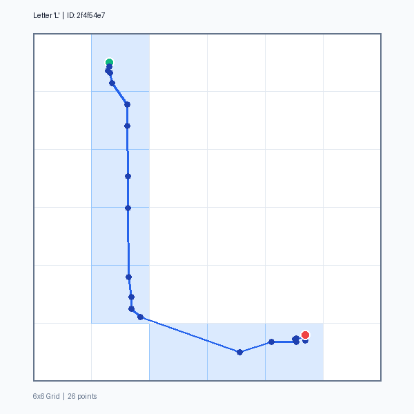
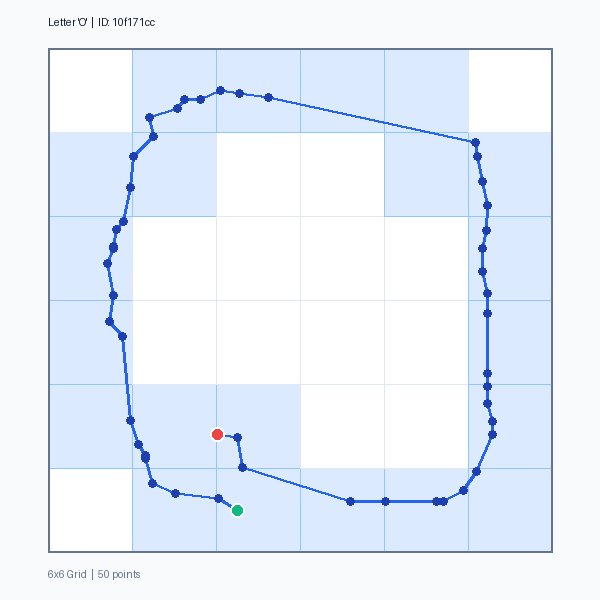
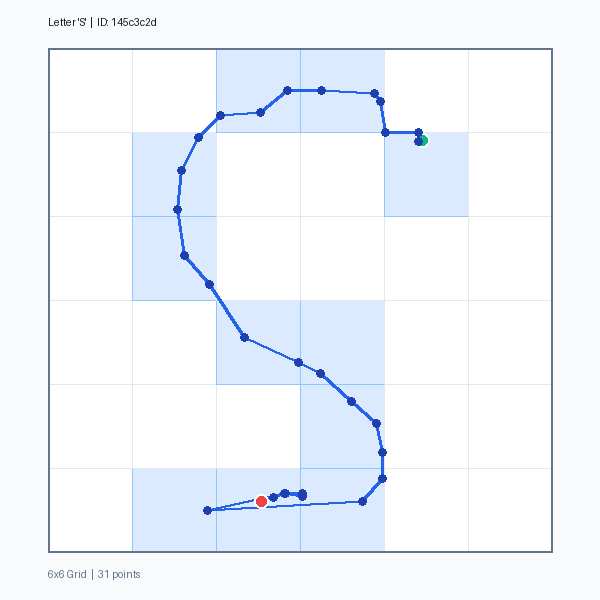
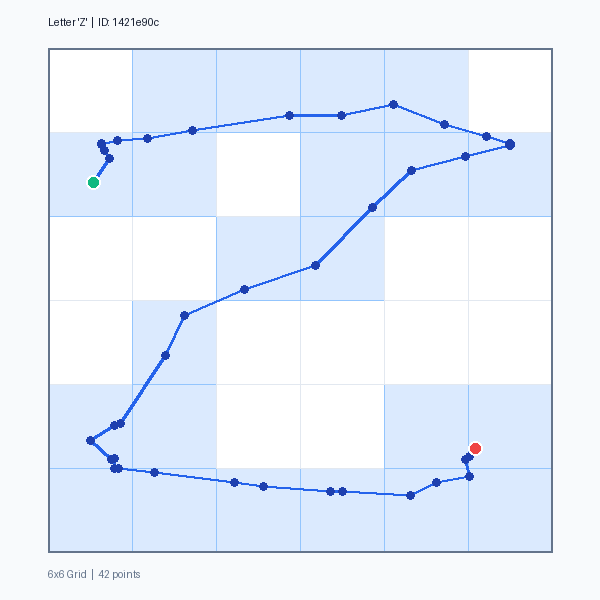

---

## Machine Learning in Python (Random Forest) e feature engineering

### Dataset & Training Matrix (192 campioni &times; 39 feature)

<table style="width: 100%; border-collapse: collapse; font-size: 13.5px; margin: 8px 0 12px 0; background: #ffffff; border-radius: 6px; overflow: hidden; border: 1px solid #cbd5e1;">
  <thead>
    <tr style="background: #e2e8f0; color: #1e293b;">
      <th style="padding: 6px 10px; text-align: left;">ID</th>
      <th style="padding: 6px 10px; text-align: center;">Target</th>
      <th style="padding: 6px 10px; text-align: center;">Grid[0,0]</th>
      <th style="padding: 6px 10px; text-align: center;">Grid[0,1]</th>
      <th style="padding: 6px 10px; text-align: center;">...</th>
      <th style="padding: 6px 10px; text-align: center;">Aspect</th>
      <th style="padding: 6px 10px; text-align: center;">Width</th>
      <th style="padding: 6px 10px; text-align: center;">Height</th>
    </tr>
  </thead>
  <tbody>
    <tr style="border-top: 1px solid #e2e8f0;">
      <td style="padding: 5px 10px; font-family: monospace;">2f4f54e7</td>
      <td style="padding: 5px 10px; text-align: center; font-weight: bold; color: #0284c7;">L</td>
      <td style="padding: 5px 10px; text-align: center;">0.0</td>
      <td style="padding: 5px 10px; text-align: center;">0.0</td>
      <td style="padding: 5px 10px; text-align: center;">...</td>
      <td style="padding: 5px 10px; text-align: center;">1.46</td>
      <td style="padding: 5px 10px; text-align: center;">9.3 cm</td>
      <td style="padding: 5px 10px; text-align: center;">13.6 cm</td>
    </tr>
    <tr style="border-top: 1px solid #e2e8f0; background: #f8fafc;">
      <td style="padding: 5px 10px; font-family: monospace;">4a081398</td>
      <td style="padding: 5px 10px; text-align: center; font-weight: bold; color: #0284c7;">O</td>
      <td style="padding: 5px 10px; text-align: center;">0.0</td>
      <td style="padding: 5px 10px; text-align: center;">1.0</td>
      <td style="padding: 5px 10px; text-align: center;">...</td>
      <td style="padding: 5px 10px; text-align: center;">1.06</td>
      <td style="padding: 5px 10px; text-align: center;">15.0 cm</td>
      <td style="padding: 5px 10px; text-align: center;">15.9 cm</td>
    </tr>
    <tr style="border-top: 1px solid #e2e8f0;">
      <td style="padding: 5px 10px; font-family: monospace;">1421e90c</td>
      <td style="padding: 5px 10px; text-align: center; font-weight: bold; color: #0284c7;">Z</td>
      <td style="padding: 5px 10px; text-align: center;">1.0</td>
      <td style="padding: 5px 10px; text-align: center;">1.0</td>
      <td style="padding: 5px 10px; text-align: center;">...</td>
      <td style="padding: 5px 10px; text-align: center;">0.93</td>
      <td style="padding: 5px 10px; text-align: center;">11.3 cm</td>
      <td style="padding: 5px 10px; text-align: center;">10.5 cm</td>
    </tr>
  </tbody>
</table>

  &bull; <strong>17 classi</strong> distinte di lettere
  &bull; <strong>39 feature numeriche:</strong> 36 griglia binaria 6&times;6 + 3 variabili (forma della lettera)
  &bull; <strong>Modello:</strong> Random Forest (100 alberi)

  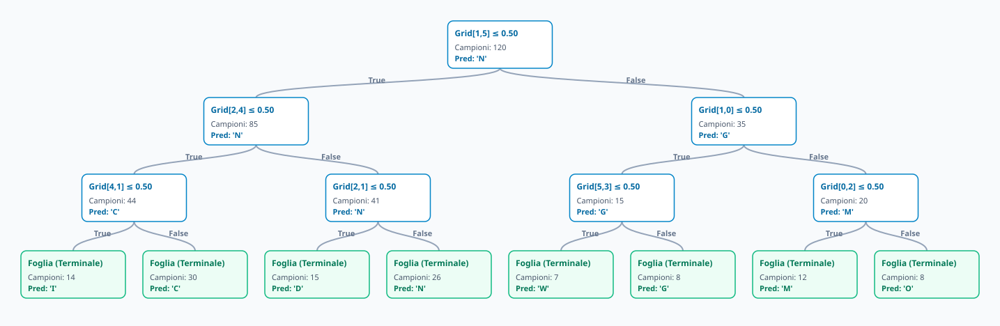

---

## Risultati Sperimentali & Analisi degli Errori

### Metriche Globali
* **Accuratezza Totale:** **91.1%**
* **Precision Macro:** **91.3%**
* **Recall Macro:** **90.9%**

### Lettere con Prestazioni Massime
* **P, G (100%):** tratti chiusi inconfondibili
* **I, S, A (>95%):** forma molto identificabile

### Ambiguità Rilevate
* **D vs J:** parte superiore aperta nei tratti veloci
* **M vs N:** bassa risoluzione della griglia 6x6 sul picco centrale (meglio 8x8)

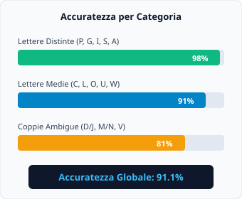

---

## Architettura software frontend + backend

### Backend in Python (FastAPI e websocket)

* **Lettura seriale non bloccante:** task asincrono di background dedicato alla lettura dello stream USB (~18–20 Hz)
* **WebSockets full-duplex:** invio dati in tempo reale di coordinate $(X, Y)$ grezze e filtrate ai client connessi
* **Inferenza & Retrain Asincrono:** esecuzione del modello Random Forest in thread pool (run_in_executor) per non bloccare l'event loop
* **Persistenza Dati:** salvataggio dati registrazioni su CSV

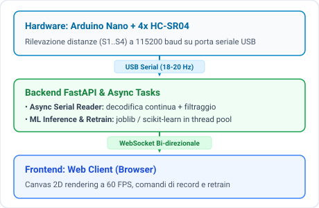

---

## Conclusioni

### Risultati Ottenuti
* Interazione touchless affidabile senza dispositivi ottici
* Sistema facile da usare e a bassa latenza

### Limiti Fisici
* Frequenza vincolata dalla velocità del suono in aria
* Sensibilità al materiale usato per il tracciamento (mano, bottiglia, etc)
* Sensibilità all'inclinazione del palmo

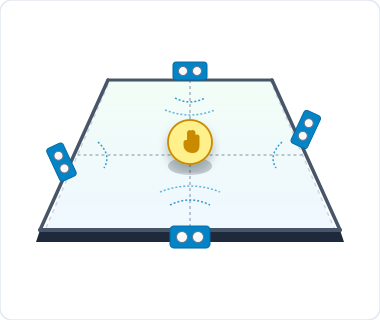

---

<!-- _class: closing -->
<!-- _paginate: false -->

# Grazie per l'Attenzione!
### 2D Ultrasonic Hand Tracker & Classifier

<a class="github-link" href="https://github.com/imivi/distance-sensor-hand-tracker" target="_blank" style="margin-top: 18px;">github.com/imivi/distance-sensor-hand-tracker</a>